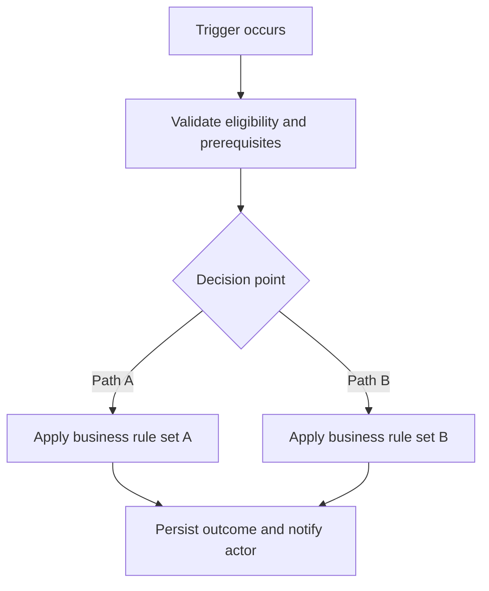
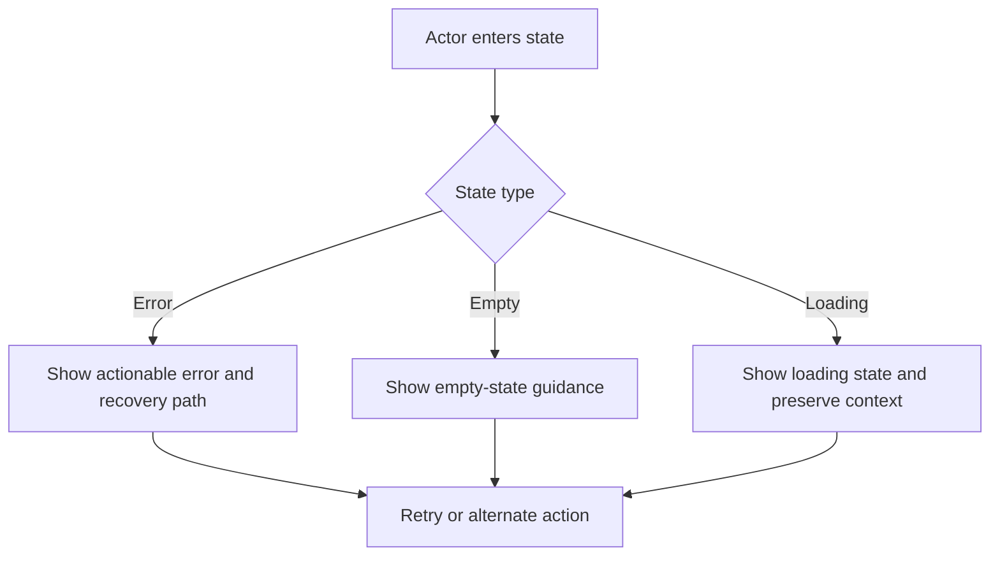

# Product Specification: [FEATURE NAME]

> WARNING: If PM/design has not compared requirements against Figma before spec creation, keep this warning in the draft.
>
> Figma comparison status: Not completed.
>
> Impact: Design alignment is not yet verified and may introduce UX or interaction gaps.
>
> Action: Continue as draft and resolve during design validation.

**Feature Branch**: `[###-feature-name]`
**Document Name**: `[feature-name-stage-spec]`
**Created**: [DATE]
**Status**: Draft
**Input**: User description: "$ARGUMENTS"
**Sources**: [PRD link/reference], [Reverse-engineering notes], [Figma file/link]

<!-- Header style rule: Do not include qualifiers like '(mandatory)' in section headings. -->

## User Scenarios & Testing

### Acceptance Criteria Format

Use Gherkin-style acceptance criteria for each user story.

#### Basic Scenario Template

```gherkin
Scenario: [Short title describing the specific behavior being tested]
  Given [Preconditions or initial state of the system]
    And [Additional context or prerequisite]
  When [The specific action or event the user performs]
  Then [The expected outcome or resulting state of the system]
    And [Any additional expected results]
```

#### Example

```gherkin
Scenario: Successful Account Login
  Given the user is on the login page
  When the user enters a valid username and password
  Then the system should authenticate the user
  And the user should be redirected to their dashboard
```

#### Scenario Outline (Data-Driven)

Use `Scenario Outline` with `Examples` when the same flow must be tested across multiple inputs.

```gherkin
Scenario Outline: Password validation rules
  Given the user is on the registration page
  When the user enters "<password>" as their password
  Then the system should display "<validation_status>"
  And the password strength meter should show "<meter_color>"

  Examples:
    | password   | validation_status  | meter_color |
    | short      | Password too short | Red         |
    | 1234abcd   | Weak password      | Orange      |
    | ValidP@ss1 | Strong password    | Green       |
```

#### Quick Tips

- Keep it user-centric: focus on what the user experiences rather than technical database updates.
- Make it testable: ensure the `Then` statement yields a verifiable pass/fail outcome.
- Focus on intent: do not specify UI design details.

## Figma Comparison Check

Before creating this spec, ask the PM: were requirements compared against
Figma/design artifacts? Record `Completed`, `Not completed`, or
`No Figma/design artifact available`.

Comparison is recommended, not mandatory. If it is not completed, keep the
warning block at the top of the draft; remove it only after the PM confirms.
Deltas go in `reconcile-notes.md` — see `references/figma-deltas-template.md`.

## User Stories

Prioritized user journeys, ordered by importance. Each must be **independently
testable**: implementing just one still yields a viable slice that delivers
value on its own — developable, testable, deployable, and demonstrable alone.
Assign P1, P2, P3…, P1 being most critical.

Repeat this block per story. Two scenarios minimum: the happy path, and the
important alternate or edge behavior.

### User Story 1 - [Brief Title] (Priority: P1)

[The journey in plain language]

**Why this priority**: [Value, and why it ranks here]

**Independent Test**: [How this is tested alone, and what value it delivers]

**Acceptance Criteria**:

```gherkin
Scenario: [Primary happy path]
  Given [initial state]
    And [additional context]
  When [action]
  Then [expected outcome]
    And [additional result]

Scenario: [Important alternate or edge behavior]
  Given [initial state]
  When [action]
  Then [expected outcome]
```

Optional: a Mermaid flowchart of the primary execution workflow, when it
communicates the end-to-end path better than prose. To ship it as an editable
draw.io SVG instead, follow `../../_shared/diagram-drawio.md`.

## Requirements

<!--
  ACTION REQUIRED: The content in this section represents placeholders.
  Fill them out with the right functional requirements.
-->

### Functional Requirements

- **FR-001**: System MUST [specific capability, e.g., "allow users to create accounts"]
- **FR-002**: System MUST [specific capability, e.g., "validate email addresses"]
- **FR-003**: Users MUST be able to [key interaction, e.g., "reset their password"]
- **FR-004**: System MUST [data requirement, e.g., "persist user preferences"]
- **FR-005**: System MUST [behavior, e.g., "log all security events"]

*Example of marking unclear requirements:*

- **FR-006**: System MUST authenticate users via [NEEDS CLARIFICATION: auth method not specified - email/password, SSO, OAuth?]
- **FR-007**: System MUST retain user data for [NEEDS CLARIFICATION: retention period not specified]

## Business Logic

<!--
  ACTION REQUIRED: Explain the core business logic for this feature in plain product language.
  Focus on decisioning, eligibility, sequencing, guardrails, and resulting outcomes.
  Keep implementation details (classes, APIs, DB schema) out of this section.
-->

### Logic Narrative

[Describe how the feature makes decisions end-to-end, including major branches and outcomes.]

### Decision Rules

| Rule ID | Condition / Input | Decision Logic | Outcome | Exception Handling |
|---|---|---|---|---|
| BL-001 | [Condition] | [How system decides] | [Result] | [Fallback or override] |
| BL-002 | [Condition] | [How system decides] | [Result] | [Fallback or override] |

### Workflow Sequencing



### Priority, Overrides, and Conflicts

| Scenario | Default Rule | Override Rule | Final Behavior | Owner |
|---|---|---|---|---|
| [Conflict scenario] | [Default behavior] | [Override behavior] | [Resolved outcome] | [Product / Policy owner] |

### Business Logic Validation

- [ ] Logic branches are complete for happy path, alternate path, and failure path.
- [ ] Every decision rule maps to at least one acceptance criterion.
- [ ] Overrides and exception handling are explicitly defined.
- [ ] Product and domain owners validated the logic narrative.

### Key Entities *(include if feature involves data)*

- **[Entity 1]**: [What it represents, key attributes without implementation]
- **[Entity 2]**: [What it represents, relationships to other entities]

## Business Rules

| ID | Rule | Applies To | Notes |
|---|---|---|---|
| BR-001 | [Rule] | [Journey / role / state] | [Notes] |

## Permissions Matrix

| Actor / Role | Can Do | Cannot Do | Notes |
|---|---|---|---|
| [Role] | [Actions] | [Restricted actions] | [Notes] |

## UX States

| State | User Sees | System Behavior | Notes |
|---|---|---|---|
| [State] | [UI] | [Behavior] | [Notes] |

## Error / Empty / Loading States



| Situation | User Message / UI | Recovery Action | Priority |
|---|---|---|---|
| [Situation] | [Message or state] | [Recovery action] | [High / Medium / Low] |

## Analytics Events

<!-- If the feature emits events, load `spec-analytics-sections.md` and paste
     both analytics sections (here, and before Approval Readiness). If it emits
     none, delete this heading and state that in Out Of Scope. -->

## Assumptions

- [Assumption]

## Out Of Scope

- [Out-of-scope item]

## Figma Alignment

| Requirement | Figma Status | Notes |
|---|---|---|
| [Requirement] | [Aligned / Gap / Conflict / N/A] | [Notes] |

## Open Questions

| Question | Owner | Needed Before | Priority |
|---|---|---|---|
| [Question] | [Owner] | [Milestone] | [High / Medium / Low] |

## Success Criteria

<!--
  ACTION REQUIRED: Define measurable success criteria.
  These must be technology-agnostic and measurable.
-->

### Measurable Outcomes

- **SC-001**: [Measurable metric, e.g., "Users can complete account creation in under 2 minutes"]
- **SC-002**: [Measurable metric, e.g., "System handles 1000 concurrent users without degradation"]
- **SC-003**: [User satisfaction metric, e.g., "90% of users successfully complete primary task on first attempt"]
- **SC-004**: [Business metric, e.g., "Reduce support tickets related to [X] by 50%"]

## Analytics And Measurement Requirements

<!-- Second half of `spec-analytics-sections.md`. Omit with the section above if
     the feature emits no events. Measurement design belongs to /analytics-plan. -->

## Approval Readiness

- Do not mark this Product Spec as approved if any mandatory section above is missing.
- Do not mark this Product Spec as approved if any mandatory section still contains placeholders.
- The Product Spec cannot be approved if analytics events, event properties, success measurement, or reporting requirements are required for the feature but missing from this section.
